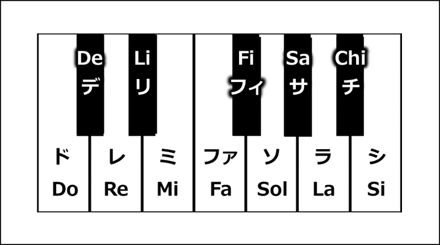

# SolfeSinger

Japanese fixed-do solfege SFZ instruments (SolfeSinger 010 and 011), accepting all 88 piano keys (A0–C8 / MIDI 21–108). Playback needs only an SFZ player.

日本語の解説は英語の後にあります。 / Japanese follows English.

## Download

Download the latest zip from [GitHub Releases](https://github.com/Frieve-A/solfesinger/releases) and extract it, keeping its folder structure. Python, a GPU, and TTS models are not required for playback.

## How to use

Load one of the following presets into an SFZ player and play Japanese fixed-do solfege from a MIDI keyboard or DAW.

| Instrument | Sustain | Decay | Sample folder |
| --- | --- | --- | --- |
| SolfeSinger 010 | [SolfeSinger_010_sustain.sfz](SolfeSinger_010_sustain.sfz) | [SolfeSinger_010_decay.sfz](SolfeSinger_010_decay.sfz) | [samples/010](samples/010) |
| SolfeSinger 011 | [SolfeSinger_011_sustain.sfz](SolfeSinger_011_sustain.sfz) | [SolfeSinger_011_decay.sfz](SolfeSinger_011_decay.sfz) | [samples/011](samples/011) |

Keep the SFZ files and the sample folders in their relative locations: the folder containing the SFZ must have `samples/010` or `samples/011` beneath it. When updating, replace both the SFZ files and the sample folders, then reload the instrument in your player.

`sustain` holds the vowel; `decay` fades out over about 3.5 seconds. Note-off release is 0.14 seconds, and the instruments respond to velocity. C4 is MIDI 60; A4 is MIDI 69 / 440 Hz.

### Regular and `_fold` presets

Each voice has per-pitch samples for C3–F6 / MIDI 48–89. Other keys play a sample of the same syllable at a faster or slower speed.

- **Regular presets** (`SolfeSinger_010_sustain.sfz` etc.) play every key at the requested pitch. The lowest and highest keys are played at up to 1/8 or 4 times speed, so their consonants and timbre change more.
- **`_fold` presets** (`SolfeSinger_010_fold_sustain.sfz` etc.) limit playback to 0.5, 1, or 2 times speed. Keys more than one octave outside the sample range sound in another octave of the same syllable, so the output range is C2–F7 / MIDI 36–101.

[Key ranges and examples](docs/REGISTERS.md)

The [listening page](demos/index.html) contains renders of the regular presets: all 12 semitones, a melody, high notes up to C8, and a five-second held note.

## Solfege syllables

| Note | C | C♯ / D♭ | D | D♯ / E♭ | E | F | F♯ / G♭ | G | G♯ / A♭ | A | A♯ / B♭ | B |
| --- | --- | --- | --- | --- | --- | --- | --- | --- | --- | --- | --- | --- |
| Spelling | Do | De | Re | Li | Mi | Fa | Fi | Sol | Sa | La | Chi | Si |
| Japanese pronunciation | ド | デ | レ | リ | ミ | ファ | フィ | ソ | サ | ラ | チ | シ |

## Models used to create the samples

| Instrument | Main synthesis model and speaker | Synthesized voices used for some consonants | Sample list |
| --- | --- | --- | --- |
| SolfeSinger 010 | [MeloTTS-Japanese](https://huggingface.co/myshell-ai/MeloTTS-Japanese) / JP | Qwen3-TTS Ryan and Ono Anna; [Kokoro-82M](https://huggingface.co/hexgrad/Kokoro-82M) `jf_alpha` | [010 manifest](samples/010/manifest.json) |
| SolfeSinger 011 | [Qwen3-TTS CustomVoice](https://huggingface.co/Qwen/Qwen3-TTS-12Hz-1.7B-CustomVoice) / Ono_Anna | Qwen3-TTS Ryan; Kokoro-82M `jf_alpha`; MeloTTS JP | [011 manifest](samples/011/manifest.json) |

The TTS consonants are kept, and the vowels are pitch-shifted with PSOLA and WORLD.

## Sample format

Each voice has 66 WAVs shared by its four SFZ presets:

- 42 per-pitch WAVs for MIDI 48–89 (`048_Do.wav` … `089_Fa.wav`)
- 12 `_r05.wav` files for slower playback (MIDI 48–59) and 12 `_r2.wav` files for faster playback (MIDI 78–89). Their consonant length and attack timing are adjusted so they sound natural when played at a different speed.

All WAVs are 48 kHz / 24-bit PCM / mono. The manifests list each WAV's syllable, loop points, and SHA-256.

## License

The SFZ files, WAVs, and scripts are distributed under the [MIT License](LICENSE). No credit is required for music or videos made with the instruments. Keep LICENSE when redistributing the instrument files.

## For developers

The SFZ files are generated from the sample manifests by `utils/build_sfz.py`. See [docs/BUILD.md](docs/BUILD.md).

## Contact information

- [X / Twitter](https://twitter.com/frievea)
- [Frieve.com](https://www.frieve.com/)

---

SolfeSingerは日本語の固定ド階名唱を歌うSFZ音源です。現在の音源はSolfeSinger 010と011で、全88鍵のA0–C8 / MIDI 21–108に対応します。再生にはSFZプレーヤーだけが必要です。

## ダウンロード

[GitHub Releases](https://github.com/Frieve-A/solfesinger/releases) から最新のzipをダウンロードし、フォルダ構成を保ったまま展開してください。再生にPython、GPU、TTSモデルは不要です。

## 使い方

以下のプリセットをSFZプレーヤーへ読み込み、MIDI鍵盤やDAWから日本語の固定ド階名唱を演奏してください。

| 音源 | 持続する | 徐々に減衰する | サンプルフォルダ |
| --- | --- | --- | --- |
| SolfeSinger 010 | [SolfeSinger_010_sustain.sfz](SolfeSinger_010_sustain.sfz) | [SolfeSinger_010_decay.sfz](SolfeSinger_010_decay.sfz) | [samples/010](samples/010) |
| SolfeSinger 011 | [SolfeSinger_011_sustain.sfz](SolfeSinger_011_sustain.sfz) | [SolfeSinger_011_decay.sfz](SolfeSinger_011_decay.sfz) | [samples/011](samples/011) |

SFZとサンプルフォルダの相対配置を保ってください。SFZを置いたフォルダの下に `samples/010` または `samples/011` が必要です。更新時はSFZとサンプルフォルダを一緒に差し替え、プレーヤーで読み込み直してください。

`sustain` は母音を持続し、`decay` は約3.5秒で減衰します。離鍵リリースは0.14秒で、ベロシティにも反応します。C4はMIDI 60、A4はMIDI 69 / 440 Hzです。

### 通常版と `_fold` 版

各音源にはC3–F6 / MIDI 48–89の音程別サンプルがあります。それ以外の鍵盤は、同じ階名のサンプルの再生速度を変えて鳴らします。

- **通常版**（`SolfeSinger_010_sustain.sfz` など）は、全鍵盤を押した鍵盤どおりの音程で鳴らします。最低音・最高音付近は最大1/8倍速・4倍速で再生するため、子音や音色の変化が大きくなります。
- **`_fold` 版**（`SolfeSinger_010_fold_sustain.sfz` など）は、再生速度を0.5・1・2倍速に制限します。サンプル範囲から1オクターブを超えて離れた鍵盤は同じ階名の別オクターブで鳴るため、出力音域はC2–F7 / MIDI 36–101です。

[音域と鍵盤割り当ての例](docs/REGISTERS.md)

[試聴ページ](demos/index.html)に、通常版による12半音、メロディー、C8までの高音、5秒長音の演奏音声を置いています。

## 階名

| 音名 | C | C♯ / D♭ | D | D♯ / E♭ | E | F | F♯ / G♭ | G | G♯ / A♭ | A | A♯ / B♭ | B |
| --- | --- | --- | --- | --- | --- | --- | --- | --- | --- | --- | --- | --- |
| 表記 | Do | De | Re | Li | Mi | Fa | Fi | Sol | Sa | La | Chi | Si |
| 読み | ド | デ | レ | リ | ミ | ファ | フィ | ソ | サ | ラ | チ | シ |

## 制作に使用したモデル

| 音源 | 主な合成モデル・話者 | 一部の子音に使用した合成音声 | サンプル一覧 |
| --- | --- | --- | --- |
| SolfeSinger 010 | [MeloTTS-Japanese](https://huggingface.co/myshell-ai/MeloTTS-Japanese) / JP | Qwen3-TTSのRyan・Ono Anna、[Kokoro-82M](https://huggingface.co/hexgrad/Kokoro-82M)の `jf_alpha` | [010のmanifest](samples/010/manifest.json) |
| SolfeSinger 011 | [Qwen3-TTS CustomVoice](https://huggingface.co/Qwen/Qwen3-TTS-12Hz-1.7B-CustomVoice) / Ono_Anna | Qwen3-TTSのRyan、Kokoro-82Mの `jf_alpha`、MeloTTS JP | [011のmanifest](samples/011/manifest.json) |

TTSの子音を保持し、母音をPSOLAとWORLDで音程加工しています。

## サンプル形式

各音源の66 WAVを4つのSFZプリセットで共有します。

- MIDI 48–89の音程別WAV 42個（`048_Do.wav` … `089_Fa.wav`）
- 低速再生用の `_r05.wav` 12個（MIDI 48–59）と高速再生用の `_r2.wav` 12個（MIDI 78–89）。速度を変えて再生したときに自然に聞こえるよう、子音の長さとアタックのタイミングを調整しています。

WAVはすべて48 kHz / 24-bit PCM / monoです。manifestには各WAVの階名、ループ点、SHA-256を記載しています。

## ライセンス

SFZ・WAV・スクリプトは [MIT License](LICENSE) で配布します。音源を使った音楽・動画へのクレジットは不要です。音源ファイルを再配布する場合はLICENSEを保持してください。

## 開発者向け

SFZファイルは `utils/build_sfz.py` でサンプルのmanifestから生成しています。[docs/BUILD.md](docs/BUILD.md) を参照してください。

## 連絡先

- [X / Twitter](https://twitter.com/frievea)
- [Frieve.com](https://www.frieve.com/)
